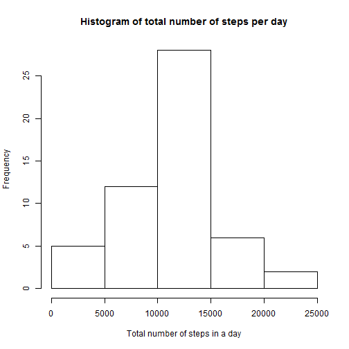
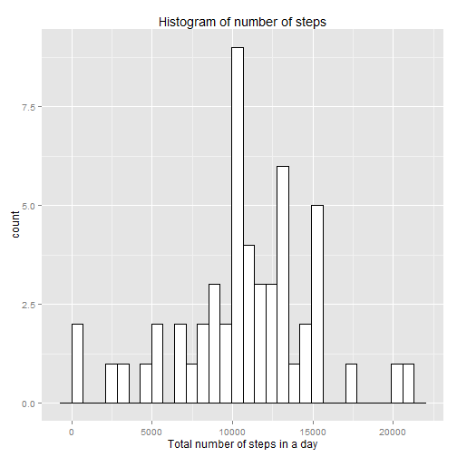
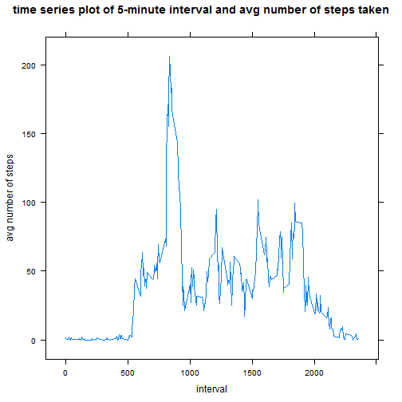
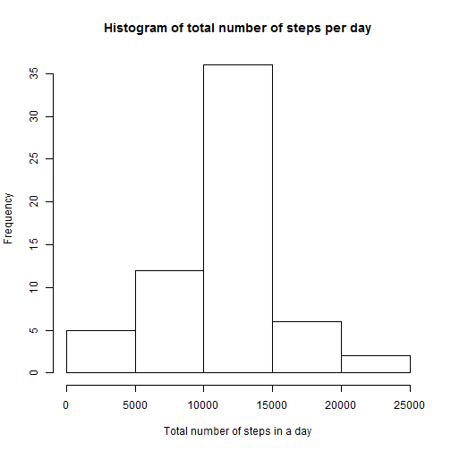
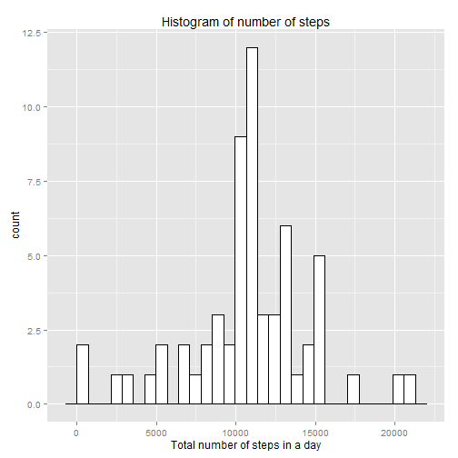
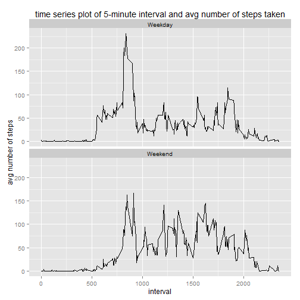

### Reproducible Research Assignment
**set some variable first...**


```r
mainDirectory <- "C:/Coursera/Data_Science/workingdirectory"
dataDirectory <- "data"
fileName <- "activity.csv"
setwd(mainDirectory)
#require(data.table)
require(lattice)
require(ggplot2)
```

**Load and process data**


```r
if (file.exists(paste(mainDirectory, dataDirectory, fileName, sep = "/", collapse = "/"))) {
     dfWithNA <- read.csv(paste(dataDirectory, fileName, sep = "/"))
     df <- na.omit(dfWithNA)
     plotData <- aggregate(steps ~ date, df, sum)
     #using data.table
     #dt <- data.table(na.omit(df), keep.rownames = TRUE)
     #plotData <- dt[, list(steps=sum(steps)), by = date]
     plotData2 <- aggregate(steps ~ interval, df, mean)
     #using data.table
     #plotData2 <- dt[, list(steps=mean(steps)), by = interval]
} 
```


**What is mean total number of steps taken per day?**


1.    Calculate the total number of steps taken per day

2.    Difference between a histogram and a barplot [link] (http://mathcentral.uregina.ca/QQ/database/QQ.09.99/raeluck1.html). Make a histogram of the total number of steps taken each day


Now, create a histogram using ggplot2 package.


```r
#graphics
hist(plotData$steps, main="Histogram of total number of steps per day", 
     xlab="Total number of steps in a day")
```

 

```r
#lattice
#histogram(plotData$steps, 
#          main="Histogram of total number of steps per day", 
#          xlab="Total number of steps in a day")

#ggplot2
#qplot(plotData$steps, geom="histogram", 
#      binwidth = 710, main = "Histogram of number of steps", 
#      xlab = "Total number of steps in a day")

#ggplot2
p = ggplot(data=plotData, aes(plotData$steps)) 
p = p + geom_histogram(binwidth = 710, fill="white",col="black") 
p = p + xlab("Total number of steps in a day") 
p = p + ggtitle("Histogram of number of steps")
print(p)
```

 

```r
#barchart(steps ~ date, data = plotData)
```

3.    Calculate and report the mean and median of the total number of steps taken per day

The mean of total number of steps per day


```r
mean(plotData$steps)
```

```
## [1] 10766.19
```

The median of total number of steps per day


```r
median(plotData$steps)
```

```
## [1] 10765
```

**What is the average daily activity pattern?**

1.    Make a time series plot (i.e. type = "l") of the 5-minute interval (x-axis) and the average number of steps taken, averaged across all days (y-axis)


Create a time series plot using lattice package this time.


```r
#lattice
xyplot(plotData2$steps ~ plotData2$interval, 
       data = plotData2, 
       type = "l", 
       xlab = "interval", 
       ylab = "avg number of steps", 
       main = "time series plot of 5-minute interval and avg number of steps taken")
```

 

```r
#ggplot2
#p = ggplot(plotData2, aes(interval, steps)) 
#p = p + geom_line() 
#p = p + xlab("interval") 
#p = p + ylab("avg number of steps") 
#p = p + ggtitle("time series plot of 5-minute interval and avg number of steps taken
#, averaged across all days")
```


2.    Which 5-minute interval, on average across all the days in the dataset, contains the maximum number of steps?


```r
plotData2[which.max(plotData2$steps),]
```

```
##     interval    steps
## 104      835 206.1698
```

**Imputing missing values**

1.   Calculate and report the total number of missing values in the dataset (i.e. the total number of rows with NAs)


```r
#is.na returns logical vector, which gives position where NA is true
length(which(is.na(dfWithNA$steps)))
```

```
## [1] 2304
```

2.   Devise a strategy for filling in all of the missing values in the dataset.

3.   Create a new dataset that is equal to the original dataset but with the missing data filled in.

Easiest solution would be to fill NA with 0.


```r
#df[is.na(df)] <- 0

#is there any NAs?
#summation of 1 and 0 gives us total count
sum(as.numeric(is.na(dfWithNA$steps)))
```

```
## [1] 2304
```


```r
df <- dfWithNA
summary(df)
```

```
##      steps                date          interval     
##  Min.   :  0.00   2012-10-01:  288   Min.   :   0.0  
##  1st Qu.:  0.00   2012-10-02:  288   1st Qu.: 588.8  
##  Median :  0.00   2012-10-03:  288   Median :1177.5  
##  Mean   : 37.38   2012-10-04:  288   Mean   :1177.5  
##  3rd Qu.: 12.00   2012-10-05:  288   3rd Qu.:1766.2  
##  Max.   :806.00   2012-10-06:  288   Max.   :2355.0  
##  NA's   :2304     (Other)   :15840
```

```r
df[is.na(df)] <- 
     plotData2$steps[which(plotData2$interval 
          == df$interval)][!is.na(plotData2$steps[which(plotData2$interval == df$interval)])]

summary(df)
```

```
##      steps                date          interval     
##  Min.   :  0.00   2012-10-01:  288   Min.   :   0.0  
##  1st Qu.:  0.00   2012-10-02:  288   1st Qu.: 588.8  
##  Median :  0.00   2012-10-03:  288   Median :1177.5  
##  Mean   : 37.38   2012-10-04:  288   Mean   :1177.5  
##  3rd Qu.: 27.00   2012-10-05:  288   3rd Qu.:1766.2  
##  Max.   :806.00   2012-10-06:  288   Max.   :2355.0  
##                   (Other)   :15840
```

4.   Make a histogram of the total number of steps taken each day and Calculate and report the mean and median total number of steps taken per day.


```r
plotData <- aggregate(steps ~ date, df, sum)

#graphics
hist(plotData$steps, 
     main="Histogram of total number of steps per day", 
     xlab="Total number of steps in a day")
```

 

```r
#ggplot2
#qplot(plotData$steps, geom="histogram", binwidth = 710, 
#main = "Histogram of number of steps", 
#xlab = "Total number of steps in a day")

#ggplot2
p = ggplot(data=plotData, aes(plotData$steps)) 
p = p + geom_histogram(binwidth = 710, fill="white",col="black") 
p = p + xlab("Total number of steps in a day") 
p = p + ggtitle("Histogram of number of steps")
print(p)
```

 

The mean of total number of steps per day


```r
mean(plotData$steps)
```

```
## [1] 10766.19
```

The median of total number of steps per day


```r
median(plotData$steps)
```

```
## [1] 10766.19
```

**Are there differences in activity patterns between weekdays and weekends?**

1.   Create a new factor variable in the dataset with two levels - "weekday" and "weekend" indicating whether a given date is a weekday or weekend day.


```r
df$dtype <- as.factor(ifelse(weekdays( as.Date(df$date) )  %in% c("Saturday","Sunday"), "Weekend", "Weekday"))
```

2.   Make a panel plot containing a time series plot of the 5-minute interval (x-axis) and the average number of steps taken, averaged across all weekday days or weekend days (y-axis). 


```r
plotData2 <- aggregate(steps ~ interval + dtype, df, mean)

#ggplot2
p = ggplot(plotData2, aes(interval, steps)) 
p = p + geom_line() 
p = p + xlab("interval") 
p = p + ylab("avg number of steps") 
p = p + ggtitle("time series plot of 5-minute interval and avg number of steps taken") 
p = p + facet_wrap(~ dtype, ncol=1 )
print(p)
```

 

Removing all the variables from workspace


```r
rm(list = ls())
```
